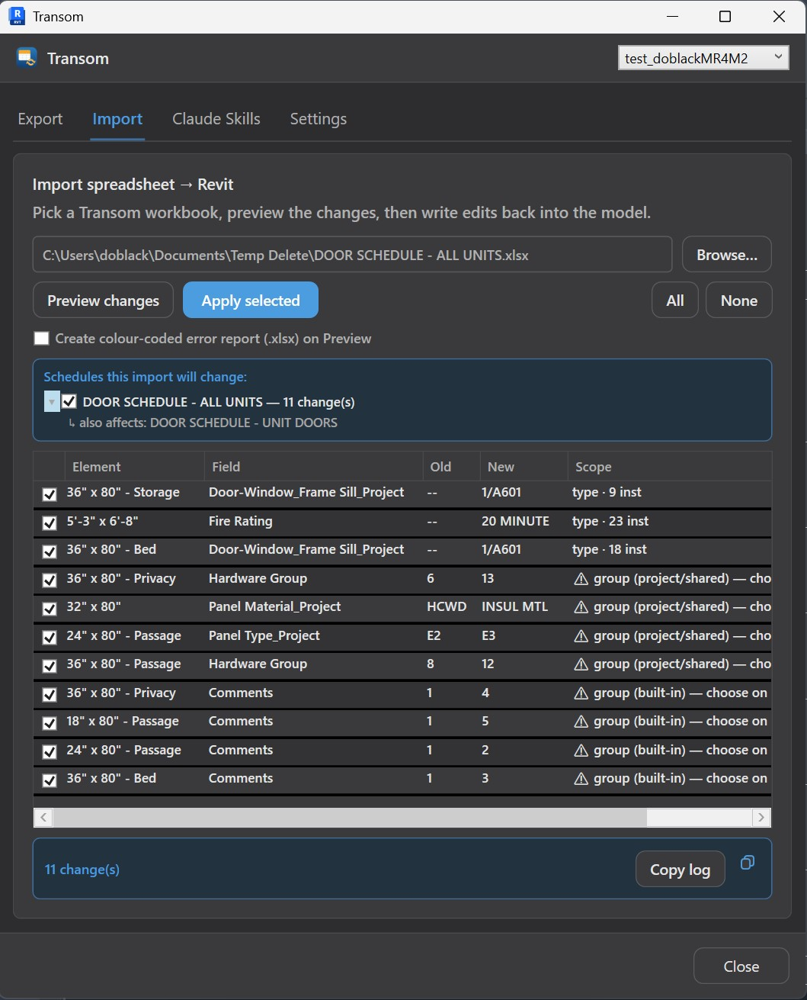
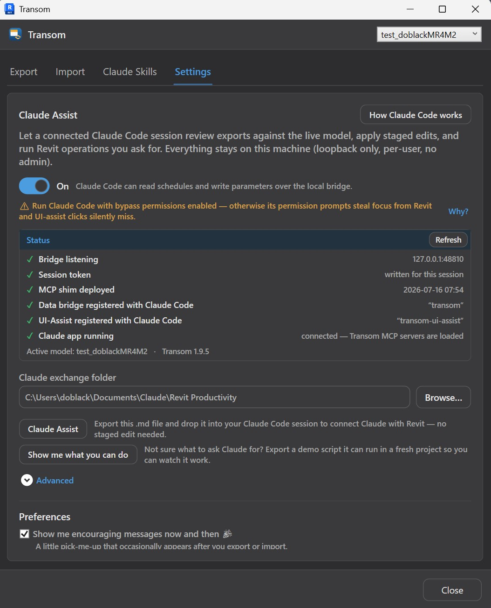
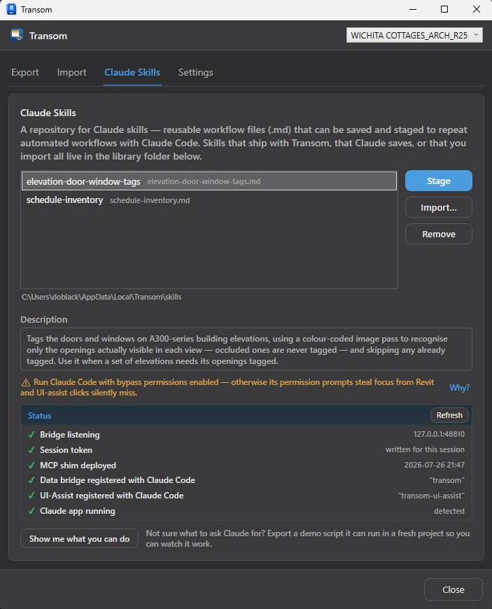
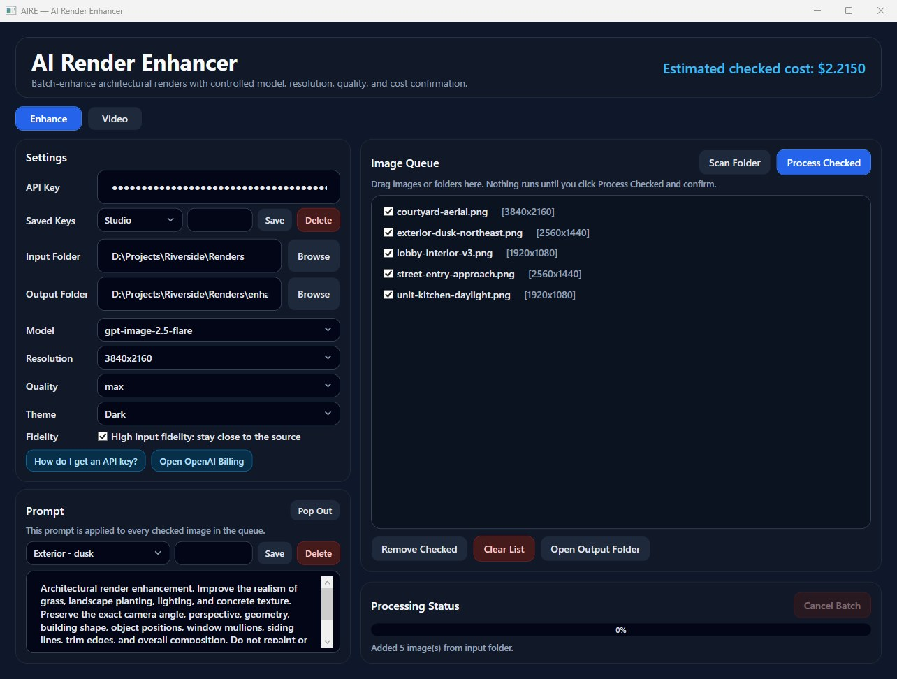
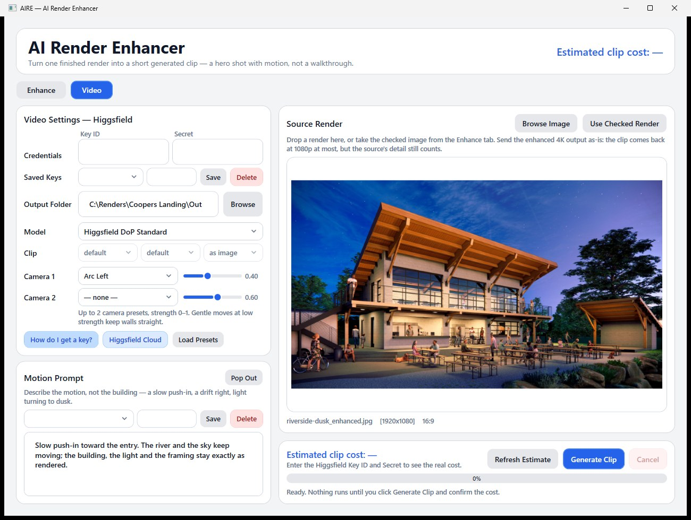

<div align="center">

<table align="center"><tr><td><pre>
████████╗██████╗  █████╗ ███╗   ██╗███████╗ ██████╗ ███╗   ███╗
╚══██╔══╝██╔══██╗██╔══██╗████╗  ██║██╔════╝██╔═══██╗████╗ ████║
   ██║   ██████╔╝███████║██╔██╗ ██║███████╗██║   ██║██╔████╔██║
   ██║   ██╔══██╗██╔══██║██║╚██╗██║╚════██║██║   ██║██║╚██╔╝██║
   ██║   ██║  ██║██║  ██║██║ ╚████║███████║╚██████╔╝██║ ╚═╝ ██║
   ╚═╝   ╚═╝  ╚═╝╚═╝  ╚═╝╚═╝  ╚═══╝╚══════╝ ╚═════╝ ╚═╝     ╚═╝
</pre></td></tr></table>


**Edit Revit schedules anywhere and import them back safely, drive the live model from Claude Code, and
enhance your renders with AI.**

[](https://github.com/Dave5264/transom-revit/releases/latest)

### ⬇ [Download the installer](https://github.com/Dave5264/transom-revit/releases/download/v1.9.15/Transom-1.9.15-SingleUser.msi)

**One click, no admin rights.** Installs into your per-user Revit add-ins folder.
Double-click the `.msi`, then start Revit. Supports **Revit 2025, 2026 & 2027**. Free.

</div>

Transom is a Revit add-in that does three things. It exports your schedules to a spreadsheet and imports your
edits back safely. It connects the live model to **Claude Code**. And it enhances your renders with AI.

The export colors every cell by what an edit to it will actually change, so you know before you type. The
hard Revit cases are handled instead of skipped. Type parameters, group headers, non-itemized rows, and
parameters on elements inside model groups all have a defined way back in.

Each part works on its own. The round-trip doesn't need Claude. The Claude layer works anywhere in the model,
schedules or not. The render enhancer only reads image files, so nothing has to be open. None of it needs
administrator rights.

### Schedules — export, edit anywhere, import back

Export the schedules you tick, one sheet each, to `.xlsx` / `.xls`, or `.csv` for a display-only copy. The
sheet looks like Revit does, down to merged headers, subtotals, fonts, colors and Revit's own row order. Edit
it in Excel, in Sheets, or on a machine with no Revit on it.

Bring it back through **Import → Preview → Apply**. The preview lists every change and which schedules it
hits. Type `2'6` for `2'-6"` and that row holds **Apply** greyed out until you confirm or discard it. What you
apply is written atomically, type parameters included, then read back to verify. If Revit rejects one change,
Transom retries the rest one at a time, so one bad value can't throw away your other edits. Cells Transom
can't write are listed and skipped, never half-applied.

Every cell is colored by what an edit to it will actually touch. White and green import directly. Blue,
yellow and red are elements inside **model groups**, which Revit locks down, and yellow and red need a
decision first ([see below](#grouped-parameters--claude-assist)). Grey can't be written at all. The full
legend is on the Export tab.

<table>
<tr>
<td width="50%"></td>
<td width="50%"></td>
</tr>
<tr>
<td><em><b>Export</b>: tick the schedules you want. The color legend sits right above the list.</em></td>
<td><em><b>Import → Preview</b>: every change with its old and new value, how far it reaches, and which schedules it touches. Rows on group members get flagged before anything is written.</em></td>
</tr>
</table>

### Claude Code integration

The Claude layer talks to the live model over a **local bridge**. Loopback only (`127.0.0.1`), authenticated
with a per-session token, and bundled with the add-in. There's no separate install, no admin rights, and
nothing leaves your machine.

Ask Claude Code for model work in plain language. Cross-check a schedule, apply staged edits, create sheets
and views, run bulk edits, tag things. The in-process `execute_revit_code` tool gives it the **full Revit
API**, plus about 35 purpose-built tools (views, elements, creation, MEP) that were each live-verified against
a real project model. A second server, `transom-ui-assist`, lets Claude **take over the Revit interface**
where the API has no path at all. Mostly that means **Edit Group** mode
([below](#grouped-parameters--claude-assist)).

The **skill library** (Schedule Hub → Claude Skills) keeps reusable workflows as `.md` files in a per-user
folder, so you have them in **every project**. Import your own, keep the ones Claude writes for you, and
**Stage** copies a skill's path to your clipboard to paste into Claude Code. Two ship with the add-in: a
read-only **schedule inventory**, which is a safe first thing to try, and **elevation door/window tagging**
that recognizes visible openings optically, so it won't tag the ones hidden behind the facade.

Turning it on, once:

1. Turn **Claude Assist** on in Transom Settings (Schedule Hub → Settings tab). The first ON registers
   Transom's MCP servers and starts the bridge.
2. Restart Claude Code so it launches the shim and picks up the new servers.

<table>
<tr>
<td width="50%"></td>
<td width="50%"></td>
</tr>
<tr>
<td><em><b>Settings</b>: one <b>Claude Assist</b> toggle, and a checklist of every layer between Revit and Claude Code, so a broken one is obvious.</em></td>
<td><em><b>Claude Skills</b>: the skill library. Import your own, keep the ones Claude writes, and <b>Stage</b> one to paste straight into Claude Code.</em></td>
</tr>
</table>

Drop the guidance file from [`claude/`](claude/) (`CLAUDE.md`) into your project root or `~/.claude/CLAUDE.md`
and Claude Code will already know the tools and the safe-write workflow. See
[`claude/README.md`](claude/README.md) for exactly where it goes. If you can't think of what to ask for,
**Show me what you can do** exports a demo script Claude can run in a fresh project while you watch. Use
**Claude Code**, not Claude Cowork, which runs in a VM that can't reach a bridge on your machine. Run it with
bypass permissions on, or its permission prompts will steal focus from Revit and the UI-assist clicks will
silently miss.

### AI render enhancement — AIRE

**AI Render Enhancer** has its own ribbon button and two tabs. **Enhance** improves a batch of architectural
renders through OpenAI's image models. Grass, planting, lighting and concrete texture come back photoreal,
while the camera angle, perspective, geometry, mullions, trim lines and overall composition stay exactly
where Revit put them. **Video** takes one finished render and turns it into a short generated clip
([below](#video--one-render-one-clip)). Both work on image **files**, not the model, so you don't need
a project open. You don't need Revit either. Tick **AIRE standalone app** when you install and it gets its
own Start Menu shortcut.

<table>
<tr><td></td></tr>
<tr><td><em><b>AI Render Enhancer</b>: the queue, the settings that drive the cost, and the estimate for exactly what you have ticked.</em></td></tr>
</table>

- **Point and tick.** **Scan Folder**, or drag images and folders onto the list. `.png`, `.jpg`, `.jpeg` and
  `.webp` go in, `<name>_enhanced.png` comes out, and AIRE skips its own outputs so a re-scan won't re-bill
  you. It defaults to **`gpt-image-2`** at 3840×2160, high quality.
- **Nothing is spent without a confirmation.** Every batch shows the count, model, resolution, quality and
  estimated cost before it starts, **Cancel Batch** stops one that's already running, and each run logs a row
  per image to `logs\enhancement_log_<timestamp>.csv`. Name a prompt and save it, or save one key per account
  and switch between them.
- **Bring your own key.** It's encrypted per Windows user (DPAPI) in `%AppData%\Transom\aire.json` and goes
  nowhere but `api.openai.com`. Claude can run the same batches over the bridge with `aire_enhance`,
  `aire_job_status` and `aire_cancel_job`. It reads the key from that store, so the key never passes through
  Claude. Either way, only one batch runs at a time.

#### Video — one render, one clip

The **Video** tab turns one finished render into a few seconds of motion. Ideally that's the 4K
`_enhanced.png` the Enhance tab just made. It goes through [Higgsfield](https://cloud.higgsfield.ai), which
is one credential for their own DoP camera models plus Kling, Veo, Seedance, Hailuo, Sora and Wan. This is a
hero shot, not a walkthrough. Clips run 2 to 12 seconds and top out at 1080p.

<table>
<tr><td></td></tr>
<tr><td><em><b>Video</b>: one render, one model, only the settings that model accepts, and Higgsfield's own price for that exact request before anything is sent.</em></td></tr>
</table>

- **The price is the vendor's, not a guess.** The cost on the tab is Higgsfield's estimate for the exact
  request that would be sent, and it refreshes whenever you change a setting. If that estimate can't be
  obtained, **Generate Clip** is refused outright. The confirmation names the model, duration, resolution,
  aspect ratio, camera preset, source file, destination folder, and the exact credits and dollars.
- **Every setting comes from the model.** The 21 image-to-video models are generated from Higgsfield's
  published API spec into a catalog (`%AppData%\Transom\higgsfield-models.json` overrides the built-in one),
  so each one offers only the durations, resolutions and aspect ratios it actually accepts. A setting a model
  doesn't have is shown as unavailable instead of hidden. Camera presets, up to two with a strength slider
  each, only appear on the Higgsfield DoP models, because those are the only ones that take them. **Load
  Presets** reads the named list from your account. If a model can't produce your render's aspect ratio, you
  get a warning before Generate instead of a silent crop after.
- **Cancel means what Higgsfield means by it.** Cancel a queued request and Higgsfield refunds it. Once
  generation starts it will finish and you'll be charged, so **Cancel** is only live while the clip is
  uploading or queued, and it tells you why when it isn't. A 10 second Master-tier clip can take eight
  minutes, so long runs show elapsed time and when the service was last polled.
- **The clip lands beside the render.** It comes out as `<name>_clip.mp4` in the output folder, which
  defaults to the Enhance output folder, plus a `logs\video_log_<timestamp>.csv` row with the request id, the
  estimate and what was actually charged. Higgsfield only keeps outputs for about a week, so AIRE downloads the file
  immediately instead of just recording a URL.
- **Same guard rails as Enhance.** One paid job at a time across Revit and the standalone app, so an image
  batch and a clip can never run together. Credentials here are a **Key ID** and **Secret** pair, encrypted
  per Windows user like the OpenAI key, with their own **Saved Keys**. The tab keeps its own saved prompts
  and pop-out editor. Claude has no video tool over the bridge, since Higgsfield ships its own MCP server for
  that.

*AIRE is much newer than the schedule round-trip and has had a lot less mileage. Treat your early batches and
clips as a trial, and check the first costs against your real OpenAI and Higgsfield usage.*

> **Status:** v1.9.15 (Revit 2025/2026/2027) gives AIRE a **Video tab**. One finished render in, one short
> generated clip out, through Higgsfield's access layer to their DoP camera models plus Kling, Veo, Seedance,
> Hailuo, Sora and Wan. The price on the tab is the vendor's own estimate for that exact request, every setting
> comes from the model's published API schema, cancel is only offered while it would still be refunded, and
> the clip is downloaded next to its render with a CSV row for the charge. Same one-job-at-a-time lock as the
> image batches. Dropdowns that a model disables now stay readable in the Dark theme.
>
> v1.9.14 gave AIRE a **reusable prompt library, saved API keys, and a pop-out prompt editor**. Name a prompt
> and save it, save one key per OpenAI account and switch from a dropdown, and edit a long prompt in a
> resizable window that follows the theme. Saved prompts and keys are written to disk the moment you save
> them.
>
> v1.9.13 gave the standalone AIRE shortcut its own icon, generated from 16 through 256 px off the same
> master as the ribbon art, so the Start Menu, taskbar and Alt-Tab all show a real frame instead of an
> upscaled one. Nothing else changed from v1.9.12.
>
> v1.9.12 brought **AIRE without Revit.** The installer offers an optional Start Menu shortcut that runs the
> AI Render Enhancer as its own app, so enhancing a folder of renders never means opening Revit. Same
> window, same settings, same encrypted key as the ribbon version. A second launch brings the existing window
> forward instead of opening AIRE twice.
>
> Making that safe also closed a real hole that was already there. AIRE's "one batch at a time" guard only
> ever applied *within one process*, so two Transom processes, say Revit 2025 and 2026 open together, could
> each start a batch against the same paid OpenAI account. That guard now holds across processes.
>
> v1.9.11 gave AIRE a **Cancel Batch** button. Before that the only way to stop a running batch was to ask
> Claude (`aire_cancel_job`), because the window had no way out. Stopping a run also used to throw away the
> CSV log for images it had already generated *and billed you for*, and then report the batch as failed.
> Cancelling before the first image did that every single time. A cancelled batch now always writes its log,
> reports itself as cancelled, not complete, and counts the images it never attempted.
>
> v1.9.10 was two deployment and robustness fixes on top of v1.9.9. The bundled helper executables now
> refresh on every Revit start **even while Claude Code holds them open**. They're running processes, so the
> old plain overwrite silently failed and left you on the previous build's helpers indefinitely. AIRE also
> retries a request that OpenAI rejected as rate-limited or that failed server-side. The stand-alone AIRE.exe
> got that free from the OpenAI SDK and the port had lost it, so one transient blip could permanently fail an
> image mid-batch. Timeouts are deliberately **not** retried, because the image may already have been
> generated and billed.
>
> v1.9.9 was a **correctness release** out of a full line-by-line audit of the codebase, plus the new
> [**AI Render Enhancer**](#ai-render-enhancement--aire) described above.
> The audit fixes that matter most: a multi-row schedule split by a hidden group field, a window schedule
> grouped by Level for instance, could write your edits to a *different* row's instances when the level names
> sorted "1, 10, 2". That ordering is now numeric and direction-aware, and it refuses to guess instead of
> writing to the wrong elements. Applying an import while a re-preview was still running could silently
> discard your typed corrections and apply the older values, so Apply now waits. Every bridge write checks
> whether Revit actually kept the transaction, so a write that Revit rolled back is reported as failed
> instead of succeeded. The reports got more honest too. Read-only cells no longer show the same red as
> genuine failures, header renames aren't counted as applied unless they verified, and the run log tells
> *proposed* apart from *applied*.
> Before that, v1.9.8 fixed export row reporting, and v1.9.7 made Transom roughly **half the size on disk**.
> The three bundled helper executables each carried an uncompressed copy of the .NET runtime, and Roslyn's
> compiler messages shipped translated into 13 languages that nothing reads. Compressing the single-file
> bundles and dropping the unused translations took the payload from about 318 MB to about 163 MB per Revit
> version, with no functional change. Before that, v1.9.6 was housekeeping. The installer now lists
> **Transom** as the Publisher in Add/Remove Programs instead of the Windows username of whoever cut the
> build, the revision narrative no longer hard-codes a firm name into the project-number line (you edit it in
> the confirm dialog), and the elevation-tagging skill finds elevation sheets from the model instead of
> assuming an A300-series numbering convention. Before that, v1.9.5 shipped five fixes out of live option-2
> UI testing, and v1.9.2 restored the Excel engine that had been dropped from the v1.8.0 through v1.9.1
> installers. Full history is on the
> [releases page](https://github.com/Dave5264/transom-revit/releases).

### Grouped parameters — Claude-Assist

Parameters on elements inside a Revit **model group** are the case that stops most schedule tools. These are
Transom's blue, yellow and red cells. A project or shared *instance* parameter is allowed to vary per group
instance, so Transom turns that flag on and writes it (blue). But a **built-in** parameter like Comments or
Finish, or a **geometry-driving** one, can only be changed from inside **Edit Group** mode. There is no API
path to it at all. So on import, Transom asks you per affected column:

- **New parameter (2a type / 2b instance).** Create one, repoint the schedule column onto it, and write your
  edits there. Nothing gets ungrouped and the built-in keeps its old values underneath. This is never offered
  for geometry-driving parameters, where a new parameter would change the schedule while the geometry sat
  still.
- **Claude-Assist.** Transom stages a `.json` and a step-by-step `.md` and doesn't touch the model itself.
  The Claude Code session already on the bridge enters Edit Group mode, sets the parameter in the Properties
  palette, finishes the group, then verifies the value and the member count. It works through excluded
  members, attached detail groups and nested groups.
- **Skip.** Leave the column alone, including its ungrouped elements.

An Edit Group edit lands on the **group definition**, so every instance of that group type gets the same
value. If you need per-instance values, take 2b instead. Claude-Assist drives the live UI, so try it on a
throwaway model first, and never Synchronize with Central mid-run on a workshared model.

## Install

The **[per-user installer](https://github.com/Dave5264/transom-revit/releases/latest)** needs no
administrator rights:

1. Download **`Transom-…-SingleUser.msi`** from the [latest release](https://github.com/Dave5264/transom-revit/releases/latest).
2. Double-click it. It installs into `%AppData%\Autodesk\Revit\Addins\` for the current user only.
3. Launch Revit and Transom is on the ribbon. To remove it later: *Apps & features → Transom*.

**Always use the SingleUser installer.** Claude-Assist's install-time setup only runs there. There's a
machine-wide **MultiUser** MSI built from this codebase for **IT and firm-wide deployment**, but it isn't
linked here on purpose. It needs admin rights and, because it runs as `SYSTEM`, it defers the MCP shim to
Revit's first launch. Build it from source if you genuinely need it.

<details>
<summary><b>Building from source</b>: targets, build commands, repo layout</summary>

| Revit | Runtime | Build configuration |
|-------|---------|---------------------|
| 2025  | .NET 8  | `Debug.R25` / `Release.R25` |
| 2026  | .NET 8  | `Debug.R26` / `Release.R26` |
| 2027  | .NET 10 | `Debug.R27` / `Release.R27` |

Built on the [Nice3point Revit SDK](https://github.com/Nice3point/RevitTemplates) (multi-version +
dynamic-loading isolation). Excel via [NPOI](https://github.com/nissl-lab/npoi).

```shell
dotnet build source/Transom/Transom.csproj -c Debug.R25   # Revit 2025 (.NET 8)
dotnet build source/Transom/Transom.csproj -c Debug.R27   # Revit 2027 (.NET 10)
```

A successful build deploys the add-in to `%AppData%\Autodesk\Revit\Addins\<version>\`, so **close Revit
before building** or the copy fails on a locked DLL.

For the MSI installer, build each configuration directly and then run the installer project. Do **not** use
`build/`'s `dotnet run -- pack`. Its compile step can drop a Revit configuration and still exit 0, which
gives you an installer that silently omits a whole Revit version.

| Path | Description |
|------|-------------|
| `source/Transom/` | the add-in (commands, views, view-models, core logic) |
| `source/Transom.Aire/` | AIRE: the OpenAI engine, the Higgsfield client and generated model catalog, both job runners, encrypted settings and the window (Revit-free: files + HTTPS) |
| `source/Transom.Aire.App/` | the standalone AIRE host (same window, its own process) |
| `build/`, `install/` | ModularPipelines build + WiX installer |
| `branding/` | ribbon icon + generator |
| `docs/` | `design-notes/` (legend copy source of truth + Revit-API research notes), `parity-tool-status.md` (bridge-tool review state), `images/` (screenshots on this page) |

</details>
